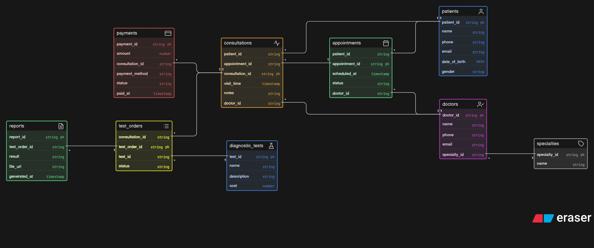

# Clinic Appointment and Diagnostics Platform – ER Diagram

## Overview

This project presents the ER diagram for a clinic management system that handles appointments, consultations, diagnostic tests, reports, and payments.

The goal of this design is to model a **real-world clinic workflow** in a clean and scalable way, ensuring clear separation between booking, actual visits, diagnostics, and reporting.

## Core Entities

The following key entities are included:

* **Patient** → Stores patient details
* **Doctor** → Stores doctor information
* **Specialty** → Represents doctor specialization
* **Appointment** → Booking made by a patient
* **Consultation** → Actual doctor visit
* **DiagnosticTest** → Master list of available tests
* **TestOrder** → Tests prescribed during consultation
* **Report** → Results generated after tests
* **Payment** → Payment information for consultations

---

## Relationships

* One patient can book multiple appointments
* One doctor can handle multiple appointments
* One appointment may or may not result in a consultation
* One consultation can have multiple diagnostic tests
* Each test order is linked to a specific consultation
* Each test order generates a report
* Payments are linked to consultations

## ER Diagram

## Files

* `erd.png` → ER Diagram image
* `README.md` → Project documentation
